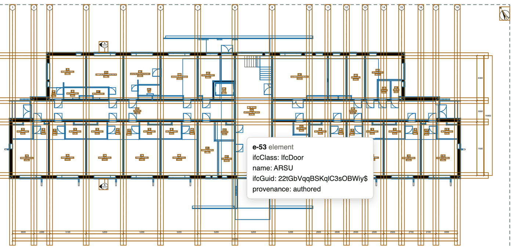

# Plannotation

[](https://github.com/plannotation/plannotation/actions/workflows/check.yml)

A PDF drawing is a picture to a machine: what the model knew is lost at export.
Plannotation attaches a JSON file, a *plannotation*, to each page of the PDF. It records
what the page shows: the sheet, its viewports and how their paper maps to the model,
each element drawn (IFC class, GlobalId, mark and outline), and the dimensions, grids,
levels, marks and callouts, with what each one measures, shows or points to. Each item
says whether it was authored from the model or inferred from the drawing. The page does
not change, pixel for pixel.

The JSON travels inside the PDF as a PDF 2.0 associated file with a PDF Declaration, the
way ZUGFeRD invoices carry their XML.

**Status: draft 0.1.** The format may change before 1.0
([versioning](spec/SPEC.md#8-versioning-policy)). Nothing is on PyPI yet.

The [site](https://plannotation.github.io/) shows a plan and a section of a real building,
drawn and plannotated from its openly licensed IFC model; [docs/examples.md](docs/examples.md)
says how.


<sub>Drawn and annotated by Plannotation from the Maleva 18 preliminary design model
(changes made); model © Esplan OÜ, [CC BY 4.0](https://creativecommons.org/licenses/by/4.0/).
Not drawn or endorsed by Esplan OÜ.</sub>

<!-- `make bench` writes its measured table between these markers. -->
<!-- BENCHMARK:START -->
<!-- BENCHMARK:END -->

## Try it

From a clone, with [uv](https://docs.astral.sh/uv/) and Cairo (`brew install cairo`,
`apt-get install libcairo2`):

```bash
git clone https://github.com/plannotation/plannotation && cd plannotation
uv run --all-extras plannotation samples build
uv run plannotation inspect samples/floorplan/sheet.plannotated.pdf
make examples
```

`samples build` draws three sample sheets from IFC models it generates; `make examples`
draws the site's plan and section from their pinned model. To see a
plannotation over its page, open the PDF in the
[inspector](https://plannotation.github.io/inspector/); it reads the file in the browser
and uploads nothing.

## What is here

- `plannotation`: the library and CLI to attach, read, strip, validate and inspect
  plannotations.
- `plannotation from-svg` and the [Bonsai add-on](docs/bonsai.md): plannotate the PDF an
  IfcOpenShell-based tool rendered, from the SVG it drew.
- [`plannotation-mcp`](docs/mcp.md): serves plannotated drawings to MCP hosts such as
  Claude Desktop, read-only by default.
- [The inspector](docs/inspector.md): one HTML file that draws a page's plannotation over
  the page.
- [`plannotation infer`](docs/inference.md): guesses a plannotation for a PDF that has
  none. It is tuned on the generated samples. On three real drawings it recovered almost
  nothing: no sheet number, no elements.

## Documentation

The [specification](spec/SPEC.md), the [JSON Schemas](plannotation/schema/), the
[guides](docs/) and the [changelog](CHANGELOG.md).

## Licence and contributing

Apache-2.0 ([LICENSE](LICENSE), [NOTICE](NOTICE)). No dependency is AGPL; LGPL is used
only unmodified and GPL only as an optional external tool. [CONTRIBUTING.md](CONTRIBUTING.md)
has the development setup, the full licence policy and the
[Code of Conduct](CODE_OF_CONDUCT.md).
