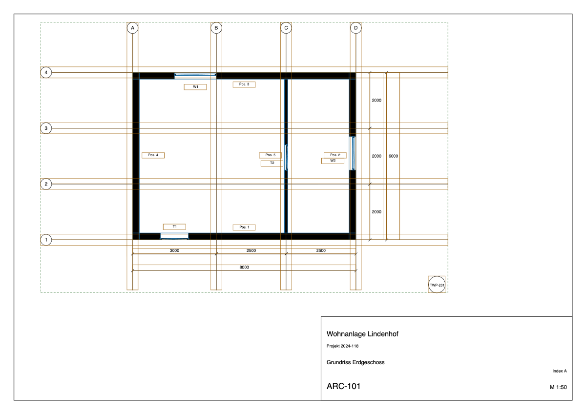
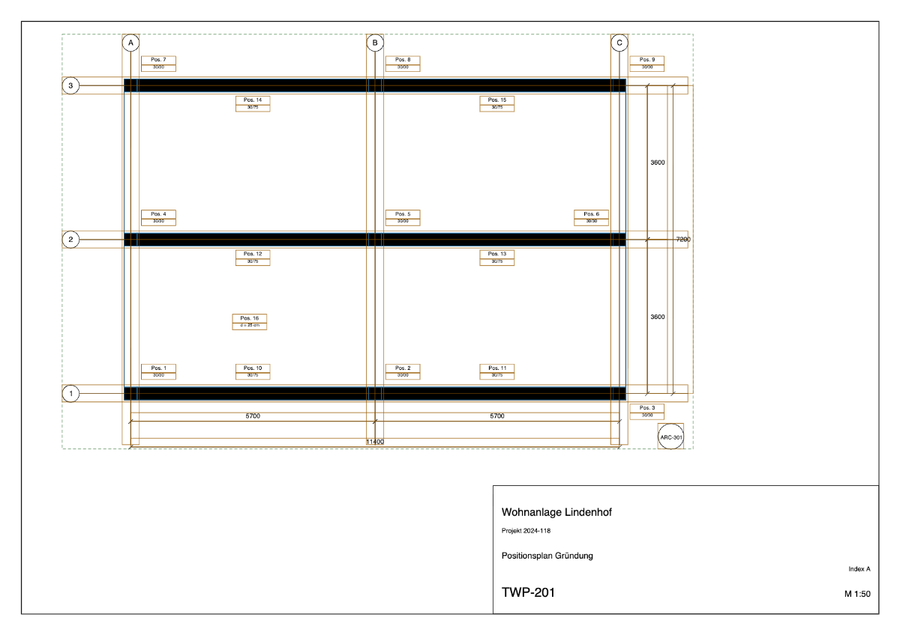
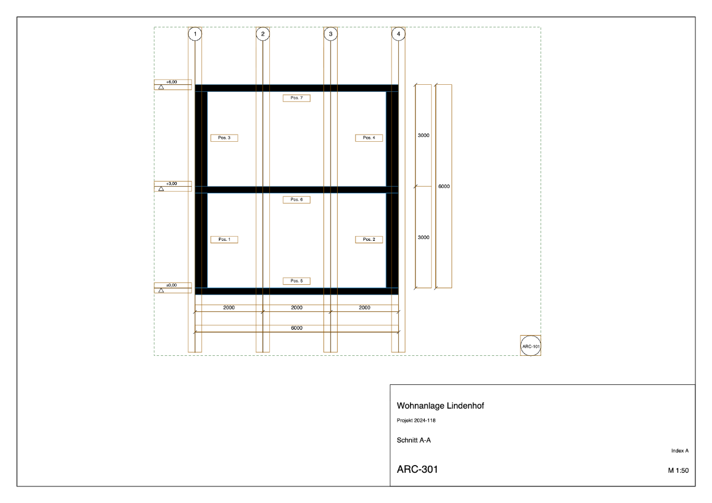

# The inspector

`inspector/index.html` is a single file. Open it in a browser, choose a labelled PDF,
and it draws the label over the page: element outlines and bounding boxes, annotation
geometry, viewport extents, with a hover tooltip and a table of everything on the sheet.

There is no build step and nothing to install. pdf.js is fetched from a CDN the first
time and cached after that; everything else is in the file.

```bash
make samples                       # build something to look at
open inspector/index.html          # then choose samples/floorplan/sheet.plannotated.pdf
```

For a terminal, `plannotation inspect` prints the same information as tables:

```bash
plannotation inspect samples/floorplan/sheet.plannotated.pdf
plannotation inspect samples/floorplan/sheet.plannotated.pdf --json | jq .pages
```

## What it reads

A page label travels as an attachment named `plannotation-pNNNN.json`. The inspector finds
it through pdf.js's `getAttachments()`, which exposes the document's `EmbeddedFiles`
name tree — which is why the carrier registers every label there as well as on the
page's own `/AF` (SPEC 6.2). A label that will not parse is treated as absent, as
SPEC 4.3 (2) requires of any reader.

Paper coordinates are millimetres with the origin at the bottom-left and y up; a canvas
is pixels with y down. One function does that flip, so nothing else has to remember it.

## Manual check

The automated tests establish that the file is self-contained and that the conventions
it hard-codes still match what Plannotation writes. They cannot establish that it looks
right, so that part is checked by hand against the samples:

1. `make samples`
2. Open `inspector/index.html` and choose `samples/floorplan/sheet.plannotated.pdf`.
3. The five walls, two doors and two windows should be outlined, each with its mark's
   tag box beside it (`Pos. n`, `T1`, `W1`).
4. The grid bubbles A–D and 1–4 should be circled, and the eight dimensions drawn.
5. Hovering an outline should name its IFC class and GlobalId.
6. Turning off **elements** should leave the annotations and the viewport frame.
7. Clicking a row in the table should highlight that one and dim the rest.
8. **Copy JSON** should put the page label on the clipboard; **Export CSV** should
   download one row per item.
9. Repeat with `positionsplan` (sixteen structural members, each with its
   cross-section) and `section` (walls and slabs on two storeys, and three levels).

The three samples as the inspector draws them, labels over the pages:






